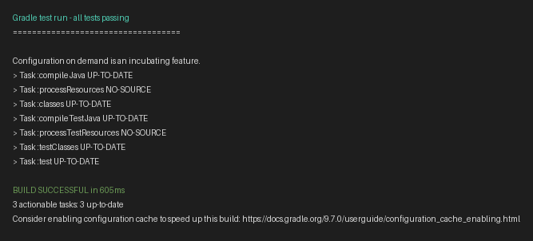
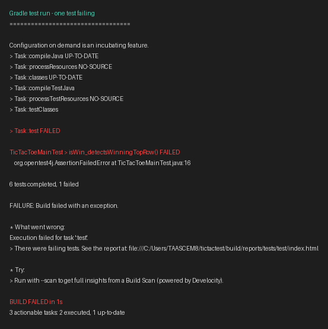

# Test Documentation – TicTacToe (M450)

Repository: [450-tictactest-mvk](https://github.com/EmilSchibli/450-tictactest-mvk)

Test framework: **JUnit 5** with **AssertJ** (`WithAssertions`)

Test location: `src/test/java/ch/bbw/m450/tictactoe/`

## Test Code on GitHub

| File | Description | Link |
|------|-------------|------|
| `DummyTest.java` | Dummy AssertJ smoke test | [View on GitHub](https://github.com/EmilSchibli/450-tictactest-mvk/blob/add-junit-tests/src/test/java/ch/bbw/m450/tictactoe/DummyTest.java) |
| `TicTacToeMainTest.java` | Five tests for `TicTacToeMain.isWin` | [View on GitHub](https://github.com/EmilSchibli/450-tictactest-mvk/blob/add-junit-tests/src/test/java/ch/bbw/m450/tictactoe/TicTacToeMainTest.java) |
| `BoardTestHelper.java` | Test helper `toBoard(String)` | [View on GitHub](https://github.com/EmilSchibli/450-tictactest-mvk/blob/add-junit-tests/src/test/java/ch/bbw/m450/tictactoe/BoardTestHelper.java) |

Run all tests:

```bat
.\gradlew.bat test
```

---

## Test Results (Screenshots)

### All tests passing



Terminal output: [test-run-pass.txt](screenshots/test-run-pass.txt)

### One test intentionally failing

For demonstration, `isWin_detectsWinningTopRow()` was temporarily changed to expect `false` instead of `true`.



Terminal output: [test-run-fail.txt](screenshots/test-run-fail.txt)

The test was restored afterwards; the suite passes again.

---

## Tests in GIVEN – WHEN – THEN

Board layout reference (indices 0–8):

```
 0 | 1 | 2
---+---+---
 3 | 4 | 5
---+---+---
 6 | 7 | 8
```

In `toBoard(String)`, `X` = cross, `O` = circle, `.` = empty.

---

### 1. DummyTest – `dummyAssertJExample`

**GIVEN** the boolean value `true`

**WHEN** AssertJ checks `assertThat(true).isTrue()`

**THEN** the assertion passes and confirms the test setup works

---

### 2. TicTacToeMainTest – `isWin_detectsWinningTopRow`

**GIVEN** a board with three crosses in the top row (`XXX......`)

**WHEN** `TicTacToeMain.isWin(board, Stone.CROSS)` is called

**THEN** the method returns `true`

---

### 3. TicTacToeMainTest – `isWin_detectsWinningMiddleColumn`

**GIVEN** a board with three crosses in the middle column (`.X..X..X.`)

**WHEN** `TicTacToeMain.isWin(board, Stone.CROSS)` is called

**THEN** the method returns `true`

---

### 4. TicTacToeMainTest – `isWin_detectsWinningMainDiagonal`

**GIVEN** a board with three crosses on the main diagonal (`X...X...X`)

**WHEN** `TicTacToeMain.isWin(board, Stone.CROSS)` is called

**THEN** the method returns `true`

---

### 5. TicTacToeMainTest – `isWin_returnsFalseWhenNoThreeInALine`

**GIVEN** a partially filled board with no three-in-a-row for either player (`XOX.OX...`)

**WHEN** `TicTacToeMain.isWin` is called for `Stone.CROSS` and `Stone.CIRCLE`

**THEN** both calls return `false`

---

### 6. TicTacToeMainTest – `isWin_returnsFalseForWrongColorDespiteWinningLine`

**GIVEN** a board where circles win the top row (`OOO......`)

**WHEN** `TicTacToeMain.isWin(board, Stone.CROSS)` is called

**THEN** the method returns `false` (wrong color), while `isWin(board, Stone.CIRCLE)` returns `true`

---

## Notes

- Test methods use package-private visibility (no `public` modifier).
- AssertJ is used via `implements WithAssertions`.
- Game logic in `src/main` was not modified; only test code was added under `src/test`.
